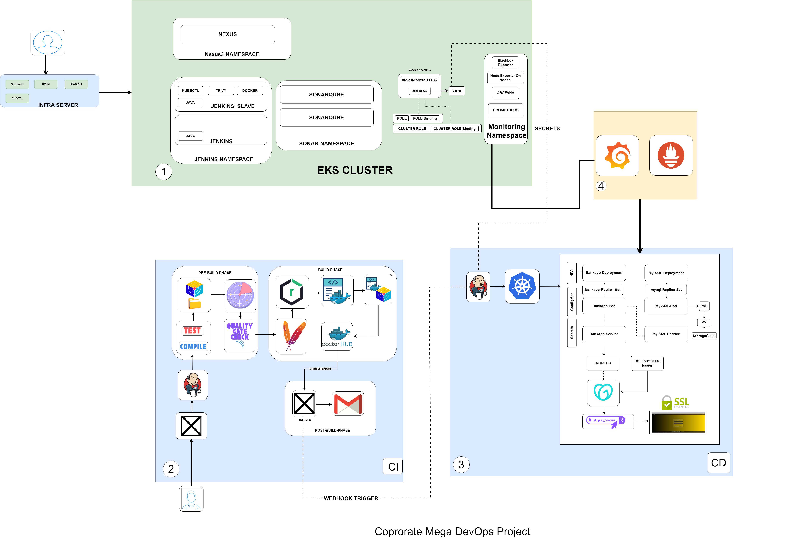

                            Corporate Bank App Mega Devops Project

Overview

This repository contains the Continuous Integration (CI) pipeline configuration and source code for the Bank Application (BankApp) a Java based banking application developed using Spring Boot. The CI pipeline is built using Jenkins and integrates with multiple tools to ensure code quality, security scanning, and artifact management.

Terraform Repository
The underlying AWS infrastructure for this project (EKS cluster, VPC, networking, etc.) is provisioned and managed using Terraform in a separate repository:
Repository: [MEGA-PROJECT-TERRAFORM-Tool](https://github.com/kelvinSeamount/MEGA-PROJECT-TERRAFORM-Tool)
Purpose: Infrastructure as Code (IaC) for provisioning AWS resources

Architecture Components

Jenkins Master

    Central CI/CD orchestration server

    Integration with SCM (GitHub)

    Webhook-based automated builds

Build Tools

    Maven: Dependency management and build automation

    Gradle: Alternative build system support

Code Quality & Security

    SonarQube: Static code analysis and quality gates

    Code coverage analysis

    Security vulnerability scanning

    Technical debt tracking

Artifact Repository

    Nexus Repository: Artifact storage and management

    Docker image registry

    Maven/Gradle artifact hosting

    Dependency proxy and caching

Infrastructure Server

    Central configuration management

    Build agent coordination

    Resource management

Prerequisites

Inorder to have seamles flow please do ensure you have this 

Jenkins server (v2.400+) with required plugins:

    Maven Integration Plugin
    SonarQube Scanner Plugin
    Docker Pipeline Plugin
    Email Extension Plugin
    Kubernetes Plugin (for CD trigger)
    GitHub Integration Plugin

Java 11 or higher installed on Jenkins

Maven 3.8+ configured in Jenkins Global Tool Configuration

Docker installed on Jenkins agent/server

Trivy security scanner installed on Jenkins agent

Access to SonarQube instance (http://3.127.39.213:9000)

Nexus Repository Manager with configured Maven settings

GitHub account with repository access

Docker Hub account for image registry

Gmail account configured for email notifications

Network access to all integrated services

NB: commands for Setting up Infra Server & Jenkins can be found in the Terraform Repository.

NB: Repository for CD https://github.com/kelvinSeamount/Bank-App-CD
